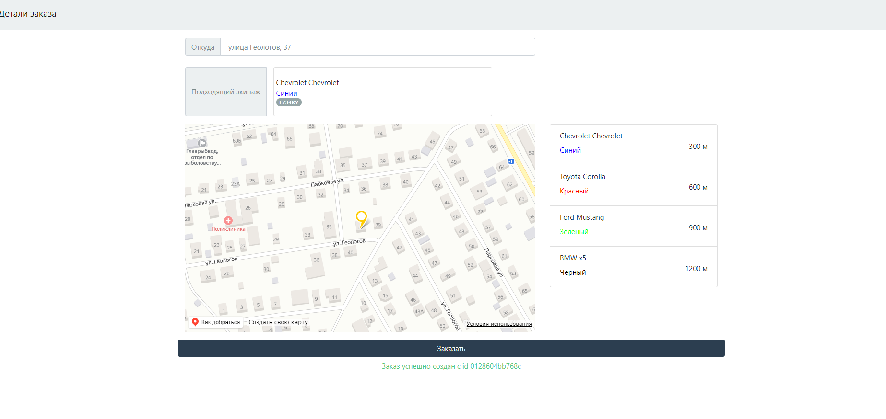

### О проекте
Проект основан на **CRA** с использованием **TypeScript**  
Дефолтные координаты прописаны к **г.Уфа**  
*API_KEY* ***временно*** выложил в открытый доступ для теста. Позже деактивирую.  
Конфиг Webpack стандартный от ***CRA***  
#### Библиотеки в проекте
- react
- date-fns
- yandex-map-api
- redux
- redux-thunk
- redux-devtools-extension
- react-bootstrap
- bootstrap

## Интерфейс

## Команды для сборки
### `yarn start`

Запуск приложения

### `yarn build`

Билд приложения для продакшн

